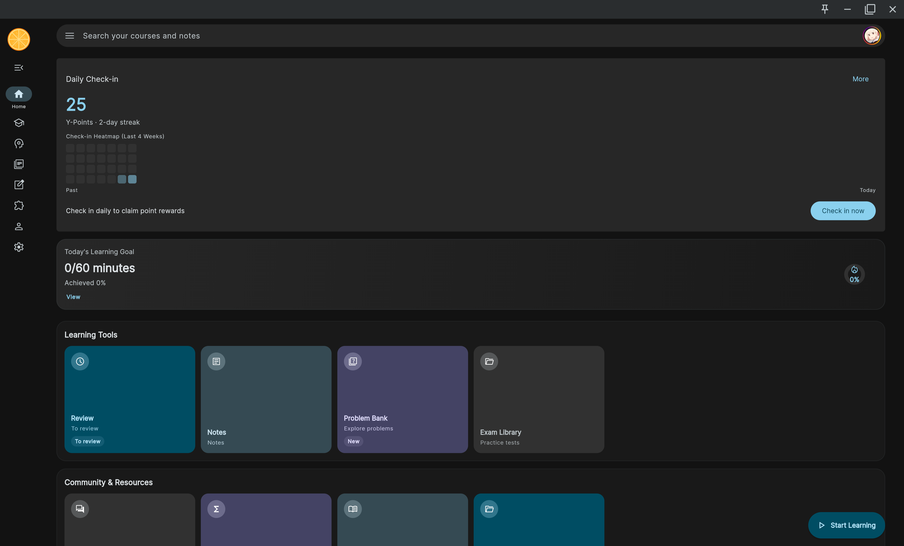
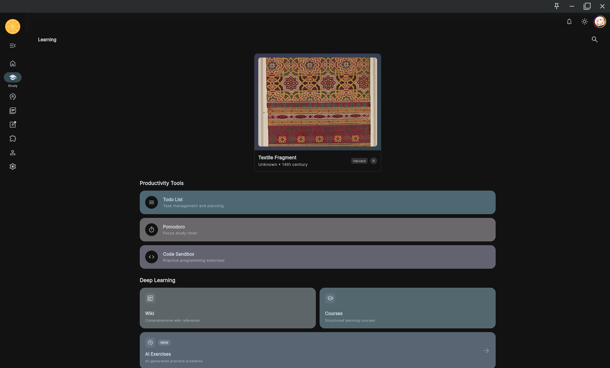
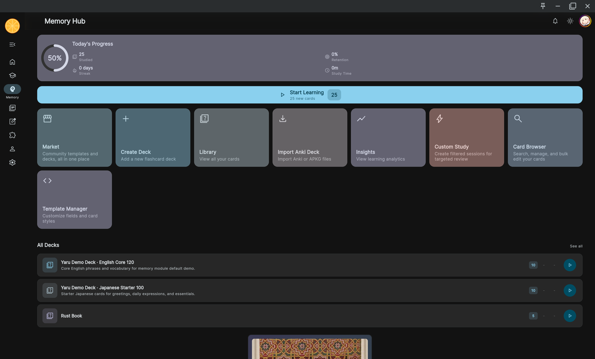
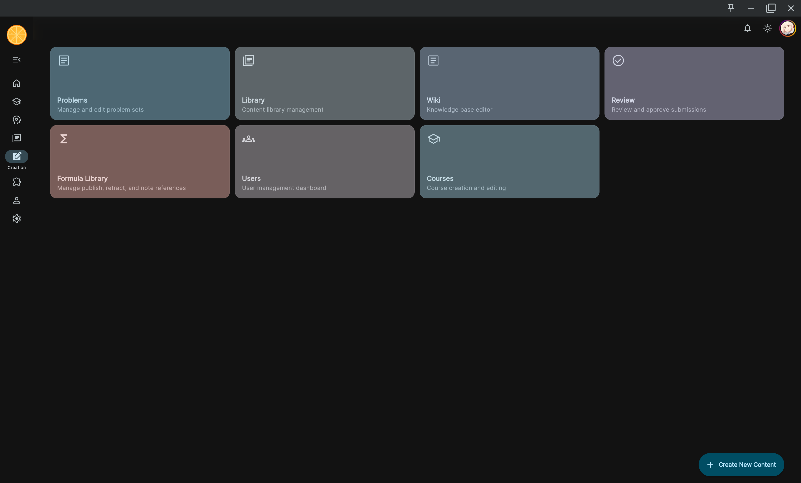
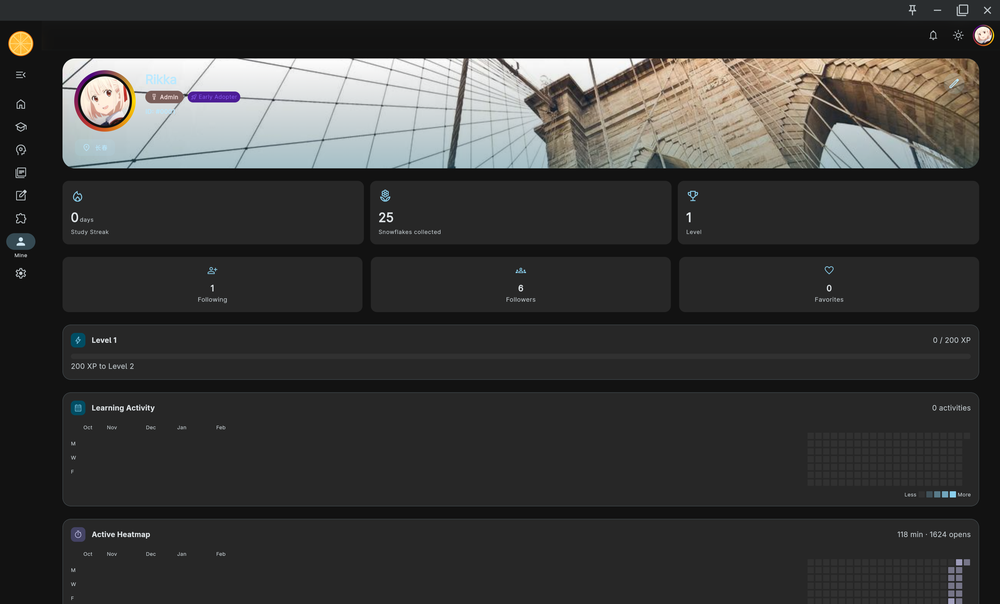
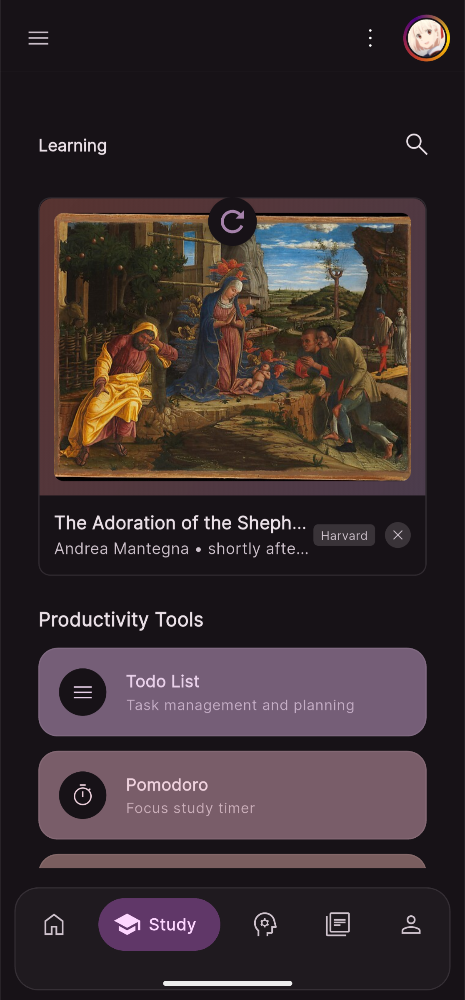
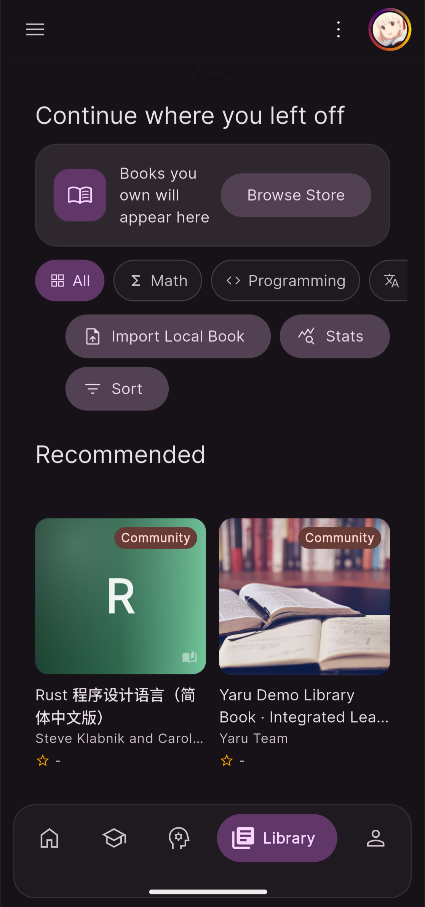
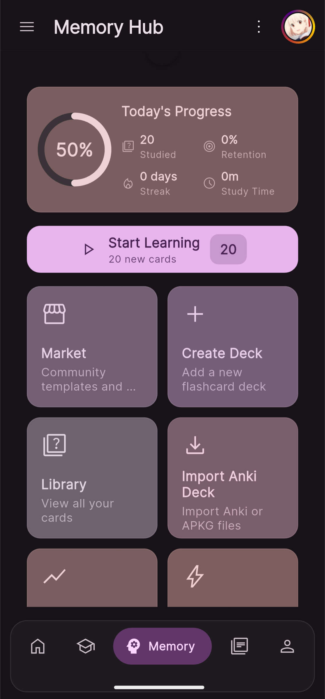
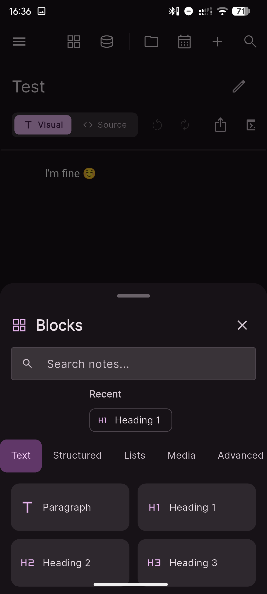
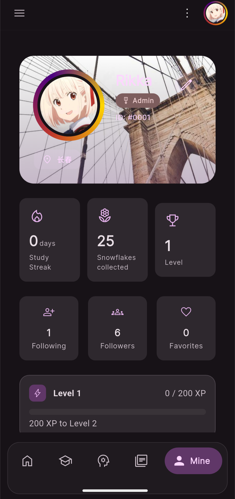

**⚠️ 注意：Yaru 为闭源软件，本仓库仅用于版本发布与问题追踪。**

# Yaru（浅颂）

Yaru（やる，to do）是一款面向学习者的 All-in-one 学习工作台，围绕 **输入 → 巩固 → 输出 → 反馈** 的完整闭环设计，帮助你减少工具切换，把注意力集中在学习本身。

## 为什么做 Yaru

很多学习工具都很优秀，但通常只覆盖一个环节：

- 输入工具很多，但输入后难以顺畅进入巩固与输出
- 闪卡工具效果好，但制卡成本高、上下文容易丢失
- 笔记与知识库工具强大，但容易陷入“搭系统”而不是“学内容”
- 多端体验割裂，移动端学习与回顾成本高

Yaru 的目标是把这些环节连接起来，形成可持续的学习 workflow。

## 核心模块

- **📖 学习模块**：路线图式课程学习（类似 Brilliant / Math Academy）
- **📚 书库模块**：支持 PDF / EPUB / MOBI / AZW3 / Markdown / HTML
- **🧠 记忆模块**：间隔重复 + 主动召回
- **✍️ 创作模块**：积木式编辑器（Block Editor）
- **🧩 扩展模块**：计划支持浏览器扩展、RSS、视频摘要导入
- **📝 笔记 / 题库 / 社区**：持续建设中

## 主要特点

- Material You 设计，界面简洁无广告
- 跨平台：Android / Windows / Linux / macOS / Web
- 学习与记忆一体化，减少重复搬运与导入导出
- 强调上下文保留，降低“知识碎片化”

## 软件截图

### 桌面端

| 首页 | 学习 |
|---|---|
|  |  |

| 书库 | 记忆 |
|---|---|
|  |  |

| 创作 | 我的 |
|---|---|
|  |  |

### 移动端

| 首页 | 学习 |
|---|---|
|  |  |

| 书库 | 记忆 |
|---|---|
|  |  |

| 笔记块编辑器 | 我的 |
|---|---|
|  |  |

## 仓库用途

本仓库主要用于：

1. **版本发布（Releases）**：下载各平台安装包
2. **问题追踪（Issues）**：提交 Bug、功能建议与体验反馈
3. **文档与指南（Docs）**：查看使用教程与说明

## 快速入口

- 下载发布版：<https://github.com/asakatea/Yaru-release/releases>
- 反馈问题：<https://github.com/asakatea/Yaru-release/issues>
- 中文文档（简体）：`docs/zh/`
- 中文文档（繁体）：`docs/zh_Hant/`
- English Docs: `docs/en/`

## 语言版本

- 中文：`README_zh.md`
- English: `README_en.md`
